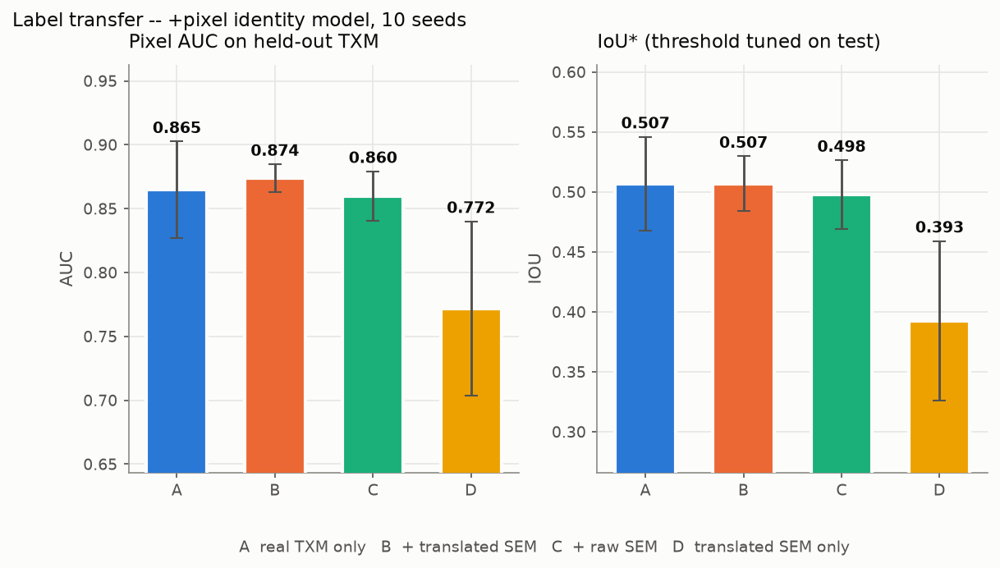
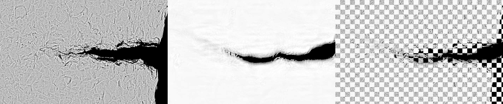
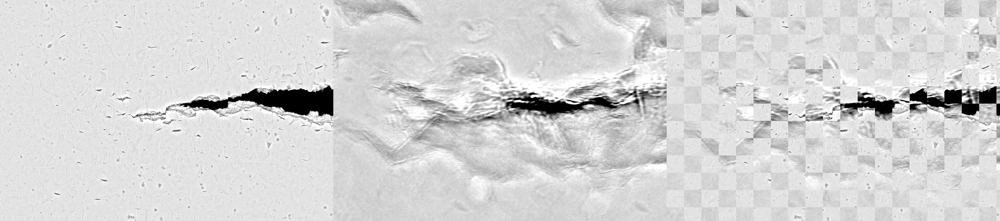
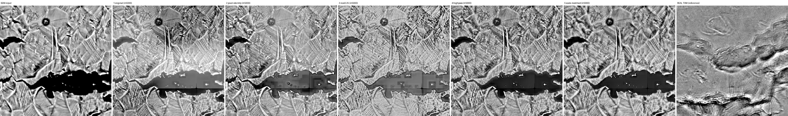
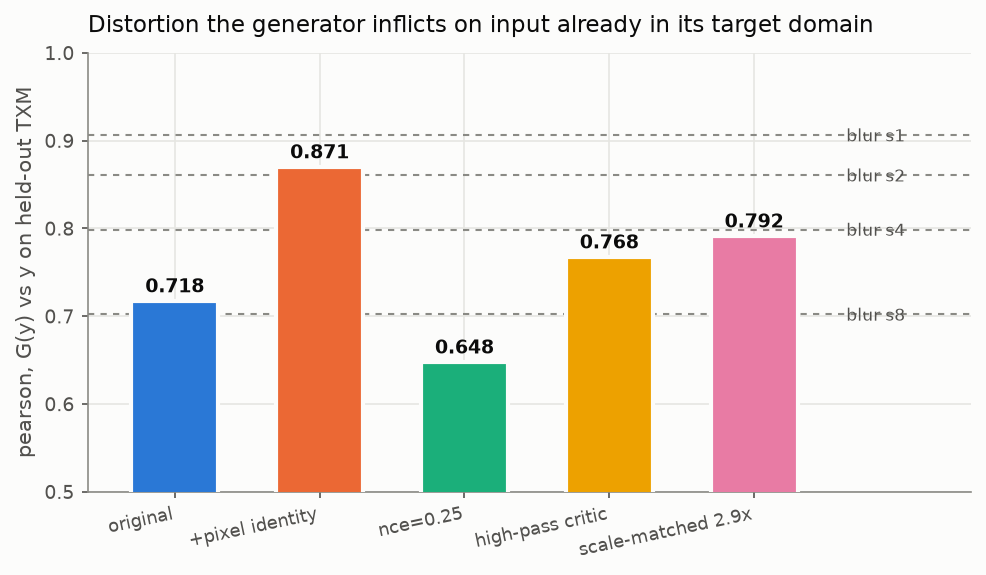

# sem2txm

Translate a SEM micrograph into the TXM domain, and test whether that lets a
hand-drawn SEM crack label teach a TXM crack detector.

Companion to [sem-crack-detector](https://github.com/jzhang29-max/sem-crack-detector)
and [TXM_Crack_Detection_Pipeline](https://github.com/jzhang29-max/TXM_Crack_Detection_Pipeline).
It reads its data from both rather than shipping a third copy of the micrographs.

> **The result is negative, and the repo is organised around saying so precisely.**
> Measured against two registered SEM/TXM pairs, the translated image is a *worse*
> predictor of the real TXM than the raw SEM is — and worse than a blurred copy of
> the raw SEM. Four separate interventions each fixed what they targeted and none
> changed that. Nothing here should be cited as showing that SEM predicts TXM.
>
> A SEM image is of a surface; a TXM image is a line integral through the bulk.
> Nothing in a surface image determines what lies beneath it. This tool re-renders a
> SEM frame in TXM appearance with its geometry held in place; it does not see
> underneath, and a feature it draws is not evidence of anything at depth.

## What the measurements say

| question | answer | evidence |
|---|---|---|
| Does a SEM mask register on the translation? | **Yes, exactly** | 39 of 39 masks, asserted every `./run prep` |
| Is a marked crack still a crack after translation? | **Yes, proportionally** | contrast correlation r = 0.87–0.98 |
| Is the output a TXM image? | **No** | classifier separates it at AUC 0.87–0.999 |
| Is it a *prediction* of the real TXM? | **No — worse than doing nothing** | 2 registered pairs, r 0.27 vs raw SEM 0.47 |
| Do transferred labels help a TXM detector? | **No** | 10 seeds, sign test p = 0.34–0.75 |
| What *is* the output, then? | **~half a contrast remap of the input** | affine R² 0.45–0.66 over 5 models |

## Install and run

```bash
git clone https://github.com/jzhang29-max/sem2txm.git
cd sem2txm && ./run predict my_micrograph.tif
```

`./run` builds its own virtualenv on first use. Individual stages:

```bash
./run predict <file|dir>   # SEM in -> predicted TXM out          <-- start here
./run prep                 # cache both modalities, cut patch banks
./run train                # train a translator
./run eval                 # appearance + geometry
./run identity             # distortion on held-out real TXM
./run transfer             # the four-arm label-transfer experiment
./run pairs                # register SEM/TXM pairs, measure real fidelity
./run scale                # recover SEM um/px from the burned-in bar
./run scalematch           # estimate the SEM:TXM ratio from texture
./run compare              # several checkpoints side by side vs real TXM
./run figures              # regenerate every figure below
./run groups               # the specimen grouping used for splits
```

Both sibling repos are expected next to this one; override with `SEM2TXM_SEM_REPO`
/ `SEM2TXM_TXM_REPO`. Every stage is resumable. Measured on an M4 Max (36 GB, torch
on MPS): `prep` ~35 min for 2.1 gigapixels, `train` 1.4–1.6 s/iter at batch 8.

**A trained generator ships with the repo** (`models/sem2txm_generator.pt`, 22 MB),
so `./run predict` works on a fresh clone without training anything. It is the
`cut_idtfix` run at iteration 5000, generator weights only — best on held-out identity
fidelity (pearson 0.871) and best two-sample AUC (0.869) of the five runs. It is also
the most rescale-like (affine R² 0.66), which is the honest trade. Read section 2
before treating its output as a prediction of anything.

## Method

**Unpaired, because the data is unpaired.** SEM `316_h_b2` and TXM `260618_b2` are
the same specimen — TXM first (18–20 June), SEM after (22 June, 8 July), the order
an in-situ load sequence followed by post-mortem SEM gives you. But no frame is
registered to any mosaic, so there is no per-pixel target to regress against.

**So the content constraint is contrastive, not a reconstruction loss.** A plain GAN
only has to look like TXM, not like *this input* — it is free to move a crack, and a
crack that has drifted takes its mask with it. The [CUT](https://arxiv.org/abs/2007.15651)
objective instead requires a patch of the output to be more similar to the *same*
patch of the input than to any other patch of it. That is what makes label transfer
coherent at all.

| term | what it buys |
|---|---|
| adversarial (LSGAN, PatchGAN critic) | output looks like a flat-fielded TXM mosaic |
| PatchNCE | output stays where the input put it |
| identity NCE | `G(real TXM) ≈ real TXM` |
| identity pixel L1 + gradient L1 *(added later)* | bounds pixel distortion, which the NCE term did not |

**The generator bottleneck is windowed self-attention** (shifted between blocks, as
in Swin), not residual convolutions. Cracks run continuously over hundreds of
pixels; stacked 3×3 convolutions reach that far only through depth, whereas
attention inside an 8×8 window at stride 4 relates points 32 px apart in one hop.
5.49 M parameters.

**One domain for both modalities.** A raw TXM mosaic is dominated by the beam and
thickness envelope — at 512 px a raw crop is mostly a smooth gradient, so a
translator trained raw-to-raw would spend its capacity inventing an envelope:


Both modalities go through the same operator family the TXM app already uses for its
human-facing view — destitch (TXM only) then pseudo-flat-field — by **importing
`destitch.py` and `flatfield.py` from that repository** rather than reimplementing
them. Reproduced on `260618_b2_337_19`: median 1.0007, IQR 0.0220, against the
0.019–0.036 that repo documents.

Full data provenance: [docs/DATA.md](docs/DATA.md).

## Results

Five training runs, each changing one thing:

| run | change | checkpoint |
|---|---|---|
| original | CUT baseline | `runs/cut/final.pt` |
| +pixel identity | identity L1 + gradient L1 added | `runs/cut_idtfix/final.pt` |
| nce=0.25 | content constraint weakened | `runs/cut_rebal/final.pt` |
| high-pass critic | critic sees high-passed input | `runs/cut_hp/final.pt` |
| scale-matched | SEM downsampled 2.9× to match physical scale | `runs/cut_s29/final.pt` |

### 1. Do transferred SEM labels teach a TXM crack detector? No.

Four arms, **equal positive and negative counts**, scored on the four dense
hand-drawn TXM frames the translator never saw (excluded by specimen in `prep.py`):

| arm | pixel AUC | IoU* |
|---|---|---|
| A  real TXM only | 0.8648 ±0.0377 | 0.5067 ±0.0392 |
| B  + translated SEM | 0.8739 ±0.0108 | 0.5070 ±0.0227 |
| C  + raw SEM | 0.8598 ±0.0193 | 0.4979 ±0.0285 |
| D  translated SEM only | 0.7717 ±0.0683 | 0.3925 ±0.0665 |

Those error bars are seed spread and overlap almost completely. All four arms are
scored on the *same* cached test set, so that spread is common and cancels in a
difference — the paired view is the informative one:


| comparison | paired ΔAUC | sign test | verdict |
|---|---|---|---|
| B − A | +0.0090 ±0.0376 | 4/10 positive, p=0.754 | not significant |
| C − A | −0.0050 ±0.0461 | 4/10 positive, p=0.754 | not significant |
| **B − C** | **+0.0140 ±0.0222** | **7/10 positive, p=0.344** | **not significant** |
| D − A | −0.0931 ±0.0785 | 0/10 positive, **p=0.002** | **significant, and negative** |

**B − C is the whole question** — both arms add SEM crack labels and differ only in
whether those labels came through the translator. It is not significant. On the
high-pass model the same comparison comes out **−0.0162, 1/10 positive, p=0.021** —
significant in the *wrong* direction, translated worse than raw.

The only significant result in the experiment is that translated SEM *alone* is
worse than real TXM labels.



**IoU\* is tuned on the test frames** — an optimistic ceiling given equally to every
arm. AUC is the number to compare.

### 2. Fidelity against real registered pairs: it loses to doing nothing

Two pairs (`B2`, `B3`, one SEM and one TXM each) made the decisive measurement
possible for the first time. **Both register** — the checkerboards show the same
crack, same shape, continuing across tile boundaries:





Prediction against the real TXM it landed on, beside the two baselines that make the
number mean anything:

| pair | | SSIM | pearson | NMI |
|---|---|---|---|---|
| B2 | predicted TXM | 0.0888 | **−0.0654** | 1.0075 |
| | raw SEM (do nothing) | 0.3345 | +0.3940 | 1.0132 |
| | blurred SEM | 0.3955 | **+0.4108** | **1.0154** |
| B3 | predicted TXM | 0.2055 | +0.3256 | 1.0195 |
| | raw SEM (do nothing) | 0.3659 | +0.4519 | 1.0234 |
| | blurred SEM | 0.5188 | **+0.4764** | **1.0245** |

On both pairs, on every metric, the translated image is a worse predictor of the real
TXM than the raw SEM. On B2 the raw SEM correlates +0.394 with the truth while the
prediction correlates **−0.065**: the translation destroys a correspondence that was
present in its own input.

The scale-matched model is worse still (B3 pearson +0.2687).

### 3. The outputs are a contrast remap, not a modality transfer

Raised by the project owner from looking at the images — *"the TXM can't just look
exactly like the SEM but a tiny bit light in colour"* — and correct. The metrics were
circling it without naming it.



Real TXM is soft, cloudy and mottled with no sharp grain facets. Every model keeps
the SEM's crisp faceted slip-band texture and fills the crack with grey. They match
TXM's contrast **range** while keeping SEM's **texture**:

| | std | IQR |
|---|---|---|
| SEM input | 0.324 | 0.706 |
| translated (best) | 0.106–0.128 | 0.131–0.174 |
| **real TXM** | **0.168** | **0.192** |

Quantified by `affine_r2` — the fraction of the output explained by a best-fit affine
map of the input — measured identically over 60 random patches for all five:

| model | affine R² |
|---|---|
| original | 0.631 ±0.152 |
| +pixel identity | 0.661 ±0.162 |
| nce=0.25 | **0.450** ±0.142 |
| high-pass critic | 0.647 ±0.135 |
| scale-matched | 0.553 ±0.178 |

**Every model sits at 0.45–0.66.** Roughly half of each output is literally its input
rescaled, and no intervention fixed it.

This supplies the mechanism for section 1 rather than leaving it a mystery: arm B adds
contrast-remapped SEM and arm C adds raw SEM, so at ~0.5 affine those are close to the
same data and B ≈ C is what should be expected. There was little to transfer that raw
SEM did not already carry.

### 4. Geometry is preserved — and this part is solid


Across **68 hand-marked crack regions in 8 frames**, comparing each region's contrast
against a ring of its own local background before and after translation: per-frame
correlation **median 0.868–0.980** depending on run. Contrast is rescaled close to
linearly, not scrambled.


Combined with the 39-of-39 mask-geometry check, the *mechanism* of label transfer is
sound. It is the downstream benefit that is absent, not the registration.

Honest caveat: only ~39–47% of marked regions stay *darker* than their surroundings.
Partly the translator flattens the largest features — a solid-black through-crack has
no counterpart in flat-fielded TXM, whose IQR is 0.022. Partly "darker" is the wrong
test: several frames have marked regions that are *brighter* than their background in
the SEM to begin with (+0.169 on one), because SEM gives a crack bright topographic
edges as well as a dark interior.

### 5. Distortion on input that is already TXM

The five reference mosaics are excluded from the training banks, so `G(x)` against
`x` is a genuine held-out paired test — a *necessary* condition, since a model that
mangles input already in the target domain cannot land a SEM frame there.



| run | SSIM | pearson | NMI |
|---|---|---|---|
| original | 0.5928 | 0.7178 | 1.0664 |
| **+pixel identity** | **0.8311** | **0.8705** | **1.1294** |
| nce=0.25 | 0.5765 | 0.6481 | 1.0541 |
| high-pass critic | 0.6080 | 0.7678 | — |
| scale-matched | 0.6533 | 0.7917 | — |

0.59 means nothing alone, so the same frame was perturbed by known amounts:

| perturbation | pearson | NMI |
|---|---|---|
| gaussian blur σ=1 | 0.9064 | 1.1288 |
| gaussian blur σ=2 | 0.8607 | 1.0974 |
| **gaussian blur σ=4** | **0.7988** | **1.0731** |
| gaussian blur σ=8 | 0.7021 | 1.0492 |

The original run's distortion is equivalent to a **4-pixel blur**. Adding the pixel
identity loss moved it to roughly **σ=1**. That fix worked — and changed nothing
downstream, which is what makes the negative sharper: translation quality improved
substantially on three independent measures at once and the benefit stayed absent.

It also exposed a gap between what was optimised and what mattered. The identity
term's own loss reached 0.024 — but in NCE *feature* space. Low identity-NCE plainly
does not imply low pixel distortion, and nothing was measuring the latter.

### 6. Appearance, and a corrected assumption about the spectrum

| run | C2ST vs real TXM (0.5 ideal) | spectrum distance to TXM |
|---|---|---|
| original | 0.9673 | 34.4% |
| **+pixel identity** | **0.8688** | 35.1% |
| nce=0.25 | 0.9991 | **29.4%** |
| high-pass critic | 0.9993 | 46.3% |
| scale-matched | 0.9990 | — |
| *SEM, do nothing* | — | *100%* |

At best 0.869 the outputs remain trivially separable from real TXM. Every run beats
the do-nothing baseline on spectrum shape, so the texture does move — just not far
enough.


The spectrum corrects an assumption this README asserted twice before measuring it.
TXM *looks* smoother than SEM, so the expectation was that it carries less
high-frequency content and a good translation should blur. The opposite holds: in the
four finest bands real TXM keeps 0.0188 / 0.0053 / 0.0024 / 0.0019 of its power
against SEM's 0.0155 / 0.0042 / 0.0014 / 0.0005. TXM is **noisier** at fine scale —
photon noise. Matching it means *adding* fine-scale noise, which is also why the
`edge_corr` diagnostic falls during training while coarse structure is untouched:
added noise is uncorrelated with the input's own fine detail by construction.

### 7. Four interventions, four failures

| hypothesis | what got fixed, measured | did the goal move? |
|---|---|---|
| the identity loss did not bound pixel distortion | 4 px blur → ~1 px (pearson 0.718 → 0.871) | **no** |
| the content constraint blocked texture transfer | affine R² 0.661 → 0.450 | **no** — appearance got worse (C2ST → 0.999) |
| the critic rewarded contrast, not texture | best crack retention, 0.963 | **no** — level match broke, C2ST → 0.9993 |
| the domains were at mismatched physical scale | scale matched, confirmed by re-registration at ratio 1.0 | **no** — paired fidelity fell to +0.269 |

Each did what it targeted. None moved the outcome. **That consistency is the
result:** on this data, with this objective family, the barrier is not in any single
loss term, weight, or resolution.

The critic diagnosis is worth one more note, because the failure was legible. With
raw input its strongest single separator was `p99` — the intensity **tail**. Given
high-passed input (verified: a pure contrast remap changes its input by 13% raw,
**0.01%** high-passed) the separators moved to `mean` / `p50` / `p25` — the central
**level**. Hiding level and gain from the critic removed the pressure to match them,
so the output level drifted. Texture pressure did arrive; the trade was one appearance
defect for another. The untried fix is a critic that gets texture pressure *and* level
pressure — a second raw-input critic, or moment matching.

### 8. Training


5.49 M parameters, batch 8, 256 px patches, 5000 iterations, 1.4–1.6 s/iter on an
idle M4 Max. Both contrastive terms fall steadily and the adversarial pair stays in a
stable band — no mode collapse, no critic runaway. The training dynamics are not the
problem.

## How much to trust this

Every claim is one of three strengths. Treating them as equal is the main way to
misread this repo.

| claim | evidence | strength |
|---|---|---|
| SEM pixel size 0.042–0.104 µm/px | instrument metadata; the scale bar agrees to 0.07% at two magnifications | **strong** |
| SEM masks register on the translation | 39 of 39 exact, asserted in `./run prep` | **strong** |
| The translation loses to raw/blurred SEM | 2 registered pairs; holds at every resolution | **moderate** |
| Transferred labels do not help | 10 seeds, sign test, equal row budgets | **moderate** |
| Outputs are ~half a contrast remap | affine R² 0.45–0.66, 60 patches, 5 models | **moderate** |
| TXM pixel size | bounded 0.13–0.27 µm/px; the two pairs disagree | **weak — do not quote** |
| any arm difference below ~0.05 AUC | inside the ±0.038 baseline seed spread | **not resolvable** |

### Could the negative result be overfitting? No.

The reason is the **direction** of the failure. Overfitting makes a model reproduce
its training distribution too well; this model performs **worse than handing back its
own input**, which no amount of memorisation produces.

The bias in fact runs the other way. A leakage audit found B2's SEM, B3's SEM and
B3's TXM were all in the training banks as *domain* examples, which should flatter the
model. No correspondence leaks, because the objective is unpaired — the model was
never shown which SEM goes with which TXM.

The genuine sampling weakness is different: **the independent unit is the specimen,
not the patch.** 18,600 SEM and 19,800 TXM patches come from 62 frames in **9**
specimen groups and 66 mosaics in **5**. Effective n is about 9 and 5. That bounds
generalisation — it does not explain a model losing to its own input.

### Could the fidelity result be a registration artifact? No.

This was the serious threat. The B3 registration leaves a **~35 px** residual, and
misalignment penalises fine detail more than coarse — which could hand the win to a
blurred baseline for entirely the wrong reason. Two controls:

**It loses to the unblurred input too**, where blur cannot help: prediction r =
+0.193 against raw SEM r = +0.252.

**The ordering is flat across resolution**, as the residual shrinks from 35 px to 2 px:

| scale | residual | prediction | raw SEM | blurred SEM |
|---|---|---|---|---|
| 1/1 | 34.8 px | 0.193 | 0.252 | 0.270 |
| 1/2 | 17.4 px | 0.195 | 0.251 | 0.268 |
| 1/4 | 8.7 px | 0.195 | 0.252 | 0.269 |
| 1/8 | 4.3 px | 0.202 | 0.256 | 0.271 |
| **1/16** | **2.2 px** | **0.179** | **0.236** | **0.252** |

Same ordering, near-identical margins, down to an effectively registered 2 px. (These
r values are computed on TXM-valid pixels only, so they differ from the section 2
table, which standardises without masking; the ordering is identical in both.)

### What could still overturn it

- **A wrong TXM scale.** Bounded, not pinned, and the two pairs disagree (2.56 vs
  3.18). The 2.9× run tested the middle of that range; a true ratio outside 2.5–3.2
  is untested.
- **Two pairs.** The fidelity conclusion rests on n=2, and B2 could not be tested at
  the rescaled setting at all (see below).
- **One objective family.** Four interventions, all CUT-derived. Paired regression on
  well-registered data, or a diffusion model, is untested here.

## Pixel scale: solved for SEM, still open for TXM

The shipped TIFFs carry no FEI/ZEISS pixel size — `tifffile` rewrote them — and the
SEM tool's provenance says so plainly (`"calibrated": false, "um_per_px": null`). Two
independent recoveries now agree.

**From the burned-in panel.** `./run scale` measures the drawn bar, whose label sits
*inside* it, so the longest run of light pixels is only half the bar:

```
260622_316_H_b2_front_CBS_01:  bar span 2372 px
  100 um / 2372 px = 0.0422 um/px  ->  HFW = 259 um
```

259 µm is the HFW printed on that same panel. Across the 51 frames that carry a
panel: 7 magnifications, **0.042–0.096 µm/px** (`out/sem_scale.json`).

**From instrument metadata.** The pair files supplied later were originals with their
`FEI_HELIOS` tag intact, which is exact and assumes nothing:

| frame | metadata µm/px | bar estimate | agreement |
|---|---|---|---|
| `260708_316_H_b2_front_CBS_002` | 0.103766 (HFW 318.8 µm) | 0.103842 | **0.07%** |
| `260622_316_amb_b3_CBS_01` | 0.042155 (HFW 259.0 µm) | 0.042159 | **0.01%** |

The bars measure 99.9 and 100.0 µm at the true scale, at two different
magnifications, so the 100 µm assumption is confirmed. `read_scale.py` reads the tag
when present and falls back to the bar.

**TXM is still open.** Those mosaics carry no panel and their `.xrm` metadata did not
survive conversion. Three attempts to recover it:

- *Cross-modality registration on the existing data:* failed. NMI 1.0005–1.006 at
  every scale, against a measured independence floor of 1.004.
- *Stage positions in the filenames:* failed, and instructively. The `260618_b2`
  series steps by a constant 0.9375 µm, so if that were an in-plane translation,
  registering consecutive frames would give µm/px directly. Phase correlation
  recovers known shifts of (7,−3) and (25,11) **exactly** on this data, so the method
  works — but measured shifts run 3 to 690 px with correlation **−0.071** against
  Δµm. Not an in-plane axis.
- *From the registered pairs:* bounded only. Ratios 2.5625 (B2) and 3.1758 (B3),
  implying **0.266** and **0.134 µm/px** — inconsistent. Mutual information is flat in
  scale (1.0245–1.0269 across ratios 1.9–2.9), and crack-mask overlap tops out at Dice
  0.108 because the segmentation does not find the same object in both modalities.

One useful sub-result: `260618_b2_343_75` and its `LARGE` field of view register to
each other at **scale 1.0020, rotation −0.385°, residual 1.07 px** — same pixel size,
so one known field of view would propagate across frames taken at the same setting.

## If you have registered pairs: `./run pairs`

Copy `pairs.example.json` to `pairs.json`, fill in the paths, and run `./run pairs`.
For each pair it preprocesses both frames through the training pipeline,
coarse-registers over scale and rotation scored by mutual information, **refuses to
continue if the match sits at the independence floor**, refines with RANSAC inside the
located window, and reports the **residual** — which decides what loss is legitimate:

| median residual | what to use |
|---|---|
| ≤ 2 px | pixel L1 / pix2pix, as in [TXM2SEM](https://github.com/suetri-a/TXM2SEM) |
| 2–8 px | contextual or patch-correlation loss, or downsample toward 2 px |
| > 8 px | distribution-level supervision only; L1 would teach blur |

It then scores predicted-vs-real fidelity against the raw-SEM and blurred-SEM
baselines, and writes a checkerboard overlay — the thing to look at before believing
any number.

**Why the supplied pairs cannot support a paired loss.** B3's block residual is
**34.8 px median (p90 50 px)** and the SEM covers 4–11% of the TXM frame. At 1/16
downsampling, where 35 px becomes ~2 px, the overlap reduces to roughly 10k pixels
per pair. That is not a training set.

Any of these fixes the TXM scale and the script converts: µm/px directly, a field of
view for one named frame, or objective + binning + camera pixel size. One caution —
`343_75` and its `LARGE` field were verified to share a pixel size, but the
`ZOOM`/`LARGE` naming implies several magnifications exist, so use
`txm_um_per_px_by_frame` if your frames differ.

## What would actually improve this

Ordered by measured evidence, not novelty.

1. **Genuinely registered pairs.** The single blocker. 35 px residual and 4–11%
   overlap cannot support the paired regression that TXM2SEM relies on — and *its*
   pairs are registered for free, because FIB-SEM mills the same volume the TXM
   imaged. Surface SEM against a projection radiograph has no such guarantee.
2. **The TXM pixel size**, from the beamline log or an unconverted `.xrm`. Bounded,
   not known, and the 2.9× test covered only the middle of the range.
3. **Dense TXM ground truth on a second specimen.** The four GT frames are all b2, so
   the transfer test set is effectively n=1 specimen. With a ±0.038 baseline seed
   spread, nothing below ~0.05 AUC is resolvable.
4. **A critic with both texture and level pressure** — a second raw-input critic, or
   moment matching alongside the high-pass one. The only untried variant with a clear
   rationale from the measurements.
5. **Not more scraped data.** The bottleneck is not volume — 2.1 gigapixels, 38k
   patches. The scarce domain is TXM, and the only openly licensed TXM set located
   ([Zenodo 4822516](https://zenodo.org/records/4822516), CC-BY, 28.2 GB) is chocolate
   eggs, a walnut and a USB stick: wrong material, wrong attenuation physics, 3D
   tomography rather than 2D mosaics. The SEM set found
   ([Zenodo 15510590](https://zenodo.org/records/15510590)) is fractography rather than
   side-surface cracks, and SEM is already the abundant domain.

## Corrections made during this work

Recorded because the reasoning that failed is part of the result.

| claimed | corrected to |
|---|---|
| "all three seeds agree" treated as support | With 3 paired differences, 3 sharing a sign happens 25% of the time. At 10 seeds that comparison is 4/10, p=0.754. It was noise; `report_transfer.py` now prints sign-test p-values. |
| appearance and transferability are competing objectives | The pixel-identity run improved both together while transfer stayed flat. Transfer is *insensitive* to translation quality across the range tested, not opposed to it. |
| weakening the content constraint will improve appearance | It made appearance worse (C2ST 0.869 → 0.9991). |
| affine R² 0.265 / 0.182 showed two runs were less rescale-like | Those came from a metric that pooled a whole batch into one affine fit. Per patch they are 0.647 and 0.450. The metric is per-patch now. |
| TXM carries less high-frequency content than SEM | Measured, the opposite: TXM holds more relative power in the four finest bands. |
| scale mismatch is the most likely fatal flaw | Separability is flat across a 16× range of downsampling, and the 2.9× run failed. Downgraded, not eliminated. |

Two sampling bugs that would have produced plausible wrong numbers are documented in
[docs/DATA.md](docs/DATA.md): a feature-window margin set from the wrong filter list
(32 px against the 192 px needed by `SMOOTH_SIGMAS` up to 64), and random window
origins that over-sample a frame's centre ~64×, which read test prevalence as
42/36/39/25% against a true 25/27/30/19%.

## Limits

- **It does not see under the surface.** The most likely misreading.
- **The headline is negative, and a negative is weaker than a positive would be.**
  B − C flipping sign across configurations rules out a *reliable* benefit at this
  effect size. It does not prove none exists.
- **The four TXM test frames are all specimen b2.** Cross-specimen generalisation of
  the transfer result is untested.
- **The real-TXM baseline is rule-taught, the SEM arms human-taught.** Arm A's
  positives come from `write_positive_crack_labels.py`, not an annotator. That
  asymmetry favours the SEM arms, so the negative is if anything understated.
- **The SEM negatives are mostly inferred.** 35,020 pixels hand-marked not-crack
  against 202.6 M qualifying by being >50 px from any mark.
- **The SEM arms used 17–37 of 39 masked frames**, depending on run.
- **B2 could not be tested at 2.9×.** Its downsampled SEM (706×1059) falls below the
  20%-of-frame template minimum added to stop spurious matches. The guard is
  calibrated for full-resolution SEM and silently excludes rescaled input — it cost a
  data point rather than producing a wrong one, but it is a real limitation.
- **Tiling artifacts are reduced, not gone.** `InstanceNorm` normalises per tile, so
  a single grid leaves rectangular patches worth 16.5% of image std (25% at tile 256).
  Two offset grids bring it to 11.2%; `predict` defaults to that. A full fix needs
  global normalisation statistics.
- **62 SEM frames and 66 usable TXM mosaics** — 2.1 gigapixels but only 9 and 5
  independent specimen groups.
- **One architecture, one hyperparameter setting per run.** No sweep over patch size
  or generator depth.

## Licence

Code MIT ([LICENSE](LICENSE)). The micrographs are not redistributed here; they
belong to the two sibling repositories and carry their CC BY 4.0 data licence.
