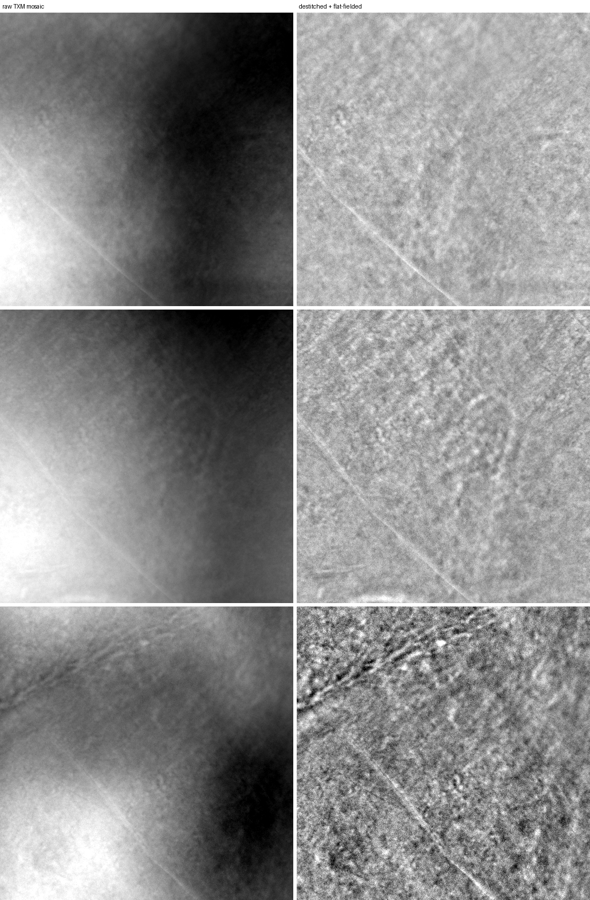
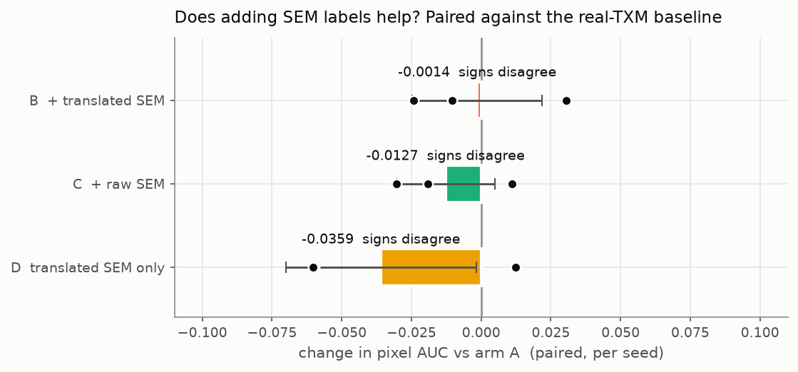
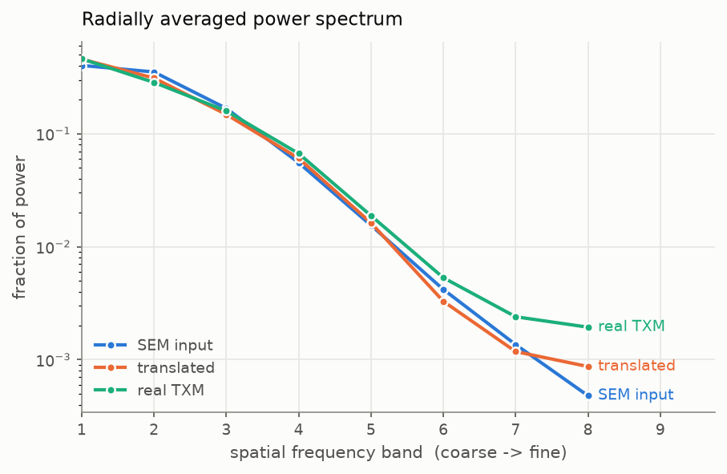
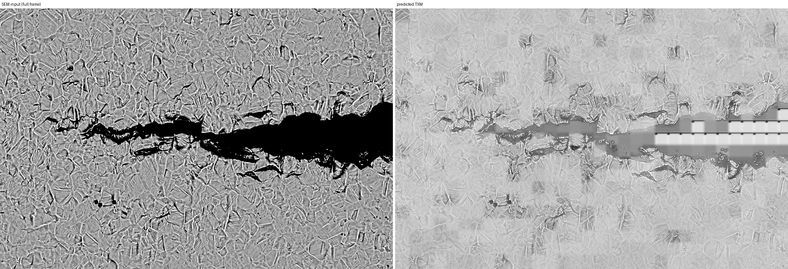
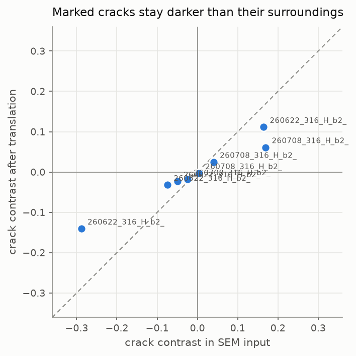
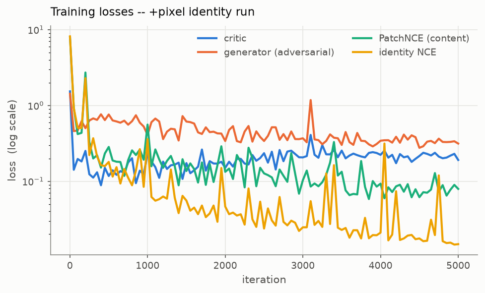

# sem2txm

Translate a SEM micrograph into the TXM domain, and test whether that lets a
hand-drawn SEM crack label teach a TXM crack detector.

Companion to [sem-crack-detector](https://github.com/jzhang29-max/sem-crack-detector)
and [TXM_Crack_Detection_Pipeline](https://github.com/jzhang29-max/TXM_Crack_Detection_Pipeline).
It reads its data from both rather than shipping a third copy of the micrographs.

> **Read this first.** A SEM image is of a surface. A TXM image is a line integral
> through the specimen. Nothing in a surface image determines what lies beneath it,
> so this tool **does not predict subsurface structure** and a feature it draws is
> not evidence that the feature exists at depth. What it does is re-render a SEM
> frame in the TXM domain with its geometry held in place. Whether that is *useful*
> is a separate, measurable question, and it is the one this repo actually answers.

## What the measurements say, up front

Mid-training (iteration 1000 of 5000), on the four dense hand-drawn TXM frames the
translator never saw:

- **Geometry survives the translation.** Across 68 hand-marked crack regions, the
  correlation between a region's local contrast before and after has a median of
  **0.982**. A mask drawn on the SEM still describes the output. This is the
  property everything else depends on, and it holds.
- **Adding SEM crack labels helps a TXM detector a little.** +0.0155 AUC through
  the translator, and all three seeds agree on the sign.
- **But the translation is not demonstrably the reason.** Pasting the SEM in
  *untranslated* also helps (+0.0091, all seeds agree), and translated-minus-raw is
  +0.0064 with the sign flipping across seeds. That comparison is the whole
  question, and it is **not resolved**.
- **The outputs are not yet TXM images.** A classifier separates them from real TXM
  at AUC **0.994**. The generator compresses contrast past the target: IQR 0.131
  against real TXM's 0.192.
- **The result is still moving with training.** At iteration 500 the same
  experiment put the translated arm *below* baseline; by 1000 it was above, while
  the two arms that do not touch the translator did not budge. Finishing the run is
  the obvious next step, and the command is in [Results](#results).

So: the machinery works and the geometry claim is solid, the headline claim is
promising but unproven, and the honest status is "not finished" rather than either
"it works" or "it doesn't".

## Install and run

```bash
git clone https://github.com/jzhang29-max/sem2txm.git
cd sem2txm && ./run
```

`./run` builds its own virtualenv on first use and then executes every stage in
order. Individual stages:

```bash
./run prep        # put both modalities in one domain, cut patch banks
./run train       # train the translator
./run eval        # appearance + geometry measurements
./run transfer    # the label-transfer experiment
./run figures     # regenerate every figure below
./run scale       # recover SEM um/px from the burned-in scale bar
./run groups      # print the specimen grouping used for splits
```

Both sibling repos are expected next to this one; override with
`SEM2TXM_SEM_REPO` / `SEM2TXM_TXM_REPO`. Every stage is resumable and skips work
already done. Measured on an M4 Max (36 GB, torch on MPS): `prep` about 35
minutes for 2.1 gigapixels, `train` 1.51 s/iter at batch 8.

## Method

**Unpaired, because the data is unpaired.** SEM `316_h_b2` and TXM `260618_b2` are
the same specimen -- TXM first (18-20 June), SEM after (22 June, 8 July), the
order an in-situ load sequence followed by post-mortem SEM gives you. But no frame
is registered to any mosaic, and nothing in either repo records a transform. There
is no per-pixel target to regress against.

**So the content constraint is contrastive, not a reconstruction loss.** A plain
GAN only has to look like TXM, not like *this input* -- it is free to move a crack,
and a crack that has drifted takes its mask with it. The
[CUT](https://arxiv.org/abs/2007.15651) objective instead requires a patch of the
output to be more similar to the *same* patch of the input than to any other patch
of it. That pins content in place without ever needing a registered pair, and it
is the reason label transfer is even coherent here.

Three terms:

| term | what it buys |
|---|---|
| adversarial (LSGAN, PatchGAN critic) | output looks like a flat-fielded TXM mosaic |
| PatchNCE | output stays where the input put it |
| identity NCE | `G(real TXM) ~ real TXM`, so the transform is not applied to material already in the target domain |

**The generator bottleneck is windowed self-attention** (shifted between blocks, as
in Swin), not the residual convolutions the original CUT used. Cracks are long,
thin and continuous over hundreds of pixels; stacked 3x3 convolutions reach that
far only through depth, whereas attention inside an 8x8 window at stride 4 relates
points 32 px apart in one hop and the shift carries it across window borders.
5.49 M parameters.

**One domain for both modalities.** A raw TXM mosaic is dominated by the beam and
thickness envelope -- at 512 px a raw crop is mostly a smooth gradient, so a
translator trained raw-to-raw would spend its capacity inventing an envelope:



Both modalities are therefore put through the same operator family the TXM app
already uses for its human-facing view -- destitch (TXM only; SEM has no tile grid)
then pseudo-flat-field -- by **importing `destitch.py` and `flatfield.py` from that
repository** rather than reimplementing them. So the domain this tool translates
*into* is exactly the domain that repo's reviewers mark cracks on. Reproduced on
`260618_b2_337_19`: median 1.0007, IQR 0.0220, against the 0.019-0.036 that repo
documents.

Full data provenance, and what it does and does not support: [docs/DATA.md](docs/DATA.md).

## Two things that had to be fixed first

**The SEM info panel.** About 280 rows at the bottom of each capture are an
instrument panel -- date, kV, HFW, detector, scale bar -- not material. Trained on,
a translator learns to generate text. Cropped using `find_field_of_view` from the
SEM repo, which was validated there across all 62 frames.

The check that licenses label transfer: the 39 correction masks were painted on the
**cropped** frame, so a correct crop reproduces their shape exactly. It does, for
**39 of 39 with zero mismatches**, reported by `./run prep` on every run. The mask
registers pixel-for-pixel, and flat-fielding preserves geometry, so it still
registers on the translated output.

**The pixel scale, which turned out to be recoverable.** The shipped TIFFs carry no
FEI/ZEISS pixel size and the SEM tool's provenance says so plainly
(`"calibrated": false, "um_per_px": null`). But the instrument burned it into the
panel. `./run scale` measures the drawn bar -- whose label sits *inside* it, so the
longest run of light pixels is only half the bar:

```
260622_316_H_b2_front_CBS_01:  bar span 2372 px
  100 um / 2372 px = 0.0422 um/px  ->  HFW = 259 um
```

259 um is the HFW printed on that same panel, and a 3072-px-wide frame gives the
same 259 um independently. Across the 51 frames that carry a panel: 7
magnifications, **0.042 to 0.096 um/px** (`out/sem_scale.json`).

This does **not** close the scale question, for two reasons. The conversion assumes
every bar reads 100 um -- confirmed for the 259 um setting, not the others. And no
equivalent recovery exists for TXM: the `.xrm` metadata did not survive conversion
either and those mosaics carry no panel. So the SEM-to-TXM pixel *ratio* is still
unknown, training happens in pixel space, and `--sem-um-per-px` /
`--txm-um-per-px` are left unset. Supply both and the ratio is applied and
reported; supply one and it is refused, the convention `semcrack.py` already uses.

## Results

Everything below comes from **one frozen checkpoint at iteration 1000 of 5000**
(`runs/cut/frozen.pt`). The run was still going when these were measured -- the
host is shared and was averaging 7 s/iter -- so this is a mid-training reading, and
the last subsection shows the result is still moving. Reproduce with
`./run eval && ./run transfer && ./run figures`.

### 1. Does a transferred SEM label teach a TXM crack detector?

Four arms, equal rows, scored on the four dense hand-drawn TXM frames the
translator never saw. AUC is threshold-free; IoU* is at the threshold that
maximises it on the test frames, an optimistic ceiling given equally to every arm.

| arm | pixel AUC | IoU* |
|---|---|---|
| A  real TXM only | 0.8805 ±0.0229 | 0.5173 ±0.0352 |
| B  + translated SEM | **0.8959** ±0.0206 | 0.5331 ±0.0414 |
| C  + raw SEM | 0.8895 ±0.0234 | **0.5348** ±0.0427 |
| D  translated SEM only, no real TXM | 0.8562 ±0.0203 | 0.4020 ±0.0277 |

Those error bars are seed-to-seed spread, they overlap almost completely, and read
alone they would say "no differences". But all four arms are scored on the *same*
cached test set, so that spread is common to them and cancels in a difference. The
paired view (`./run transfer` then `python code/report_transfer.py`):



| comparison | paired ΔAUC | per seed | reading |
|---|---|---|---|
| B − A | **+0.0155** ±0.0078 | +0.024, +0.017, +0.005 | all seeds agree |
| C − A | **+0.0091** ±0.0063 | +0.000, +0.013, +0.014 | all seeds agree |
| **B − C** | +0.0064 ±0.0136 | +0.024, +0.004, −0.009 | **not resolved** |
| D − A | −0.0242 ±0.0322 | −0.003, 0.000, −0.070 | signs disagree |

**What this supports.** Adding hand-drawn SEM crack labels to a TXM detector's
training set gives a small gain that every seed agrees on: +0.0155 AUC through the
translator, +0.0091 pasting the SEM in untranslated.

**What it does not support.** That the *translation* is what helped. B − C is
+0.0064 with the sign flipping across seeds -- and B vs C is the whole question,
because those two arms differ in nothing except whether the labels came through the
translator. On this evidence the honest answer is **not resolved**, not "it works".

**And a real negative.** Arm D -- trained only on translated SEM, with zero real
TXM crack labels -- reaches 0.8562 AUC, well above chance but below the real-TXM
baseline, and inconsistently so. Translated data is not yet a substitute for real
labels.

### 2. The result depends on how long the translator trained

Arms A and C never touch the translator, so re-running the whole experiment against
a better translator should move B and D and leave A and C exactly where they were.
It does, to four decimal places, which is also a check that the harness is
deterministic:

| arm | translator at iter 500 | at iter 1000 | change |
|---|---|---|---|
| A  real TXM only | 0.8805 | 0.8805 | — (untouched, as expected) |
| C  + raw SEM | 0.8895 | 0.8895 | — (untouched, as expected) |
| B  + translated SEM | 0.8736 | 0.8959 | **+0.0223** |
| D  translated SEM only | 0.8029 | 0.8562 | **+0.0533** |

At iteration 500 arm B was *below* the baseline (B − A = −0.0068, signs
disagreeing) -- the idea looked dead. Doubling the training moved it to +0.0155
with every seed agreeing. So the iteration-500 null was a statement about an
undertrained generator, not about the method, and the iteration-1000 result is
very likely also not the end of the curve. **The single most useful thing anyone
can do with this repo is finish the run and re-measure:**

```bash
./run train --resume runs/cut/ckpt.pt --iters 5000 && ./run apply --masked-only --force && ./run transfer
```

### 3. Appearance: not matched yet, and the measurement says how

A classifier given interpretable descriptors (intensity moments, multi-scale local
standard deviation, banded power spectrum) separates translated patches from real
TXM patches at **AUC 0.994 ±0.003**, grouped by source image. 0.5 would mean
indistinguishable, so this is nearly perfect separation: these are not yet TXM
images.

Useful part is *which* descriptor gives it away -- the intensity tail, alone worth
0.823:

| | median | IQR | std |
|---|---|---|---|
| real TXM | 0.6706 | 0.1922 | 0.1324 |
| translated | 0.6955 | **0.1312** | 0.1014 |
| SEM input | 0.6275 | 0.2824 | 0.1896 |

The generator compresses SEM's contrast (IQR 0.282) but **overshoots past TXM**,
landing at 0.131 against the real 0.192. It is not that the output is too SEM-like;
it is too flat for either domain.



The spectrum corrects an assumption worth stating because it was wrong. TXM looks
smoother than SEM to the eye, so the expectation was that it carries less
high-frequency content and a good translation would blur. Measured, the opposite
holds: in the four finest bands real TXM keeps 0.0188 / 0.0053 / 0.0024 / 0.0019 of
its power against SEM's 0.0155 / 0.0042 / 0.0014 / 0.0005. TXM is *noisier* at fine
scale -- X-ray photon noise -- and the translated output tracks SEM, i.e. it is not
yet adding enough fine-scale noise. That also explains the falling
`edge_corr` during training: matching TXM means adding noise, and noise is
uncorrelated with the input's own fine detail by construction, so a gradient
correlation drops while coarse structure is untouched.

### 4. Geometry: preserved, with contrast proportionally rescaled

This is the property label transfer actually needs, and it holds.



Across **68 hand-marked crack regions in 8 frames**, comparing each region's
contrast against a local ring of its own background, before and after translation:
the per-frame correlation between the two has a **median of 0.982** (range 0.56 to
1.00). Contrast is rescaled almost linearly, not scrambled -- so a mask drawn on
the SEM still describes a real contrast feature in the output.

The caveat: only **43%** of marked regions stay *darker* than their surroundings.
Partly that is the translator flattening the largest features -- a solid-black
25 MP-frame through-crack has no counterpart anywhere in flat-fielded TXM, and the
critic pushes it toward mid-grey. Partly it is that "darker" was the wrong test:
several frames have marked regions that are *brighter* than their surroundings in
the SEM to begin with (+0.169 on one), because SEM gives a crack bright
topographic edges as well as a dark interior. Proportional retention is the
meaningful number here; polarity is not.



### 5. Training



5.49 M parameters, batch 8, 256 px patches, 1.51 s/iter on an M4 Max with the
machine otherwise idle. Both contrastive terms fall steadily and the adversarial
pair stays in a stable band -- no mode collapse, no critic runaway.

## Limits

- **It does not see under the surface.** Stated at the top and repeated here
  because it is the single most likely misreading. This renders a SEM frame in the
  TXM domain; it does not recover subsurface structure, and a feature it draws is
  not evidence of anything at depth.
- **Mid-training.** Every number here is from iteration 1000 of a 5000-iteration
  run, and section 2 shows the headline arm was still improving. Treat all of it as
  provisional.
- **The experiment cannot resolve small effects.** The baseline's own seed-to-seed
  spread is ±0.0229 AUC, so with 3 seeds and 4 test frames nothing below roughly
  ±0.05 is separable on unpaired means. The paired analysis does better, but B − C
  at +0.0064 is still inside the noise.
- **The four TXM test frames all come from the b2 specimen.** They are the only
  dense hand-drawn ground truth that exists in either repo, so cross-specimen
  generalisation of the transfer result is completely untested.
- **The real-TXM baseline is rule-taught, the SEM arms are human-taught.** Arm A's
  positives come from `write_positive_crack_labels.py`, not an annotator. That
  asymmetry favours the SEM arms, so the small gains they show are, if anything,
  flattered.
- **IoU* is tuned on the test frames.** It is an optimistic ceiling, applied
  equally to every arm. AUC is the number to compare.
- **The scale ratio between modalities is unknown.** SEM is recoverable
  (0.042-0.096 um/px, from the burned-in bar); TXM is not. Translation is at 1:1
  pixels and nothing here has been resampled to a matched physical scale.
- **The SEM arms used 17 frames, not 39.** Translating a 25 MP frame takes about
  two minutes, and the machine was shared, so this pass translated 18 of the 39
  frames that carry a correction mask and the samplers used 17 of them. Arms B, C
  and D therefore drew on well under half the available hand-drawn SEM labels;
  arms B and C were restricted to the *same* frames, so the comparison between them
  is fair, but all three arms are under-fed. `./run apply --masked-only` over the
  full 39 is the cheapest available improvement.
- **The SEM negatives are mostly inferred, not marked.** 35,020 pixels were
  explicitly hand-marked not-crack; 202.6 M qualified as negative by being more
  than 50 px from anything the reviewer touched. In this dataset an unmarked pixel
  means "the model's opinion stands", not "not a crack", so distance is doing most
  of the work of deciding what a negative is.
- **62 SEM frames and 66 usable TXM mosaics** -- 2.1 gigapixels and 38k patches,
  but only 9 SEM and 5 TXM independent specimen groups. Pixels are plentiful;
  specimens are not.
- **Large cracks translate worst.** A solid-black through-crack has no counterpart
  in flat-fielded TXM, whose IQR is 0.022, so the critic pushes it toward mid-grey.
  Regions over ~100k px are where polarity is most often lost.

## Licence

Code MIT ([LICENSE](LICENSE)). The micrographs are not redistributed here; they
belong to the two sibling repositories and carry their CC BY 4.0 data licence.
