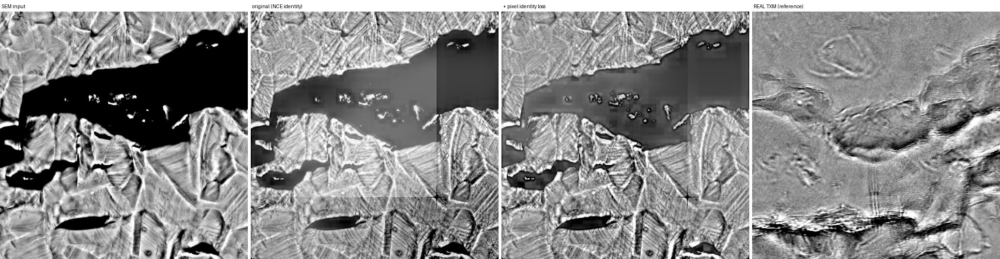
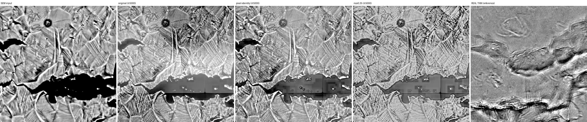

# sem2txm

Translate a SEM micrograph into the TXM domain, and test whether that lets a
hand-drawn SEM crack label teach a TXM crack detector.

Companion to [sem-crack-detector](https://github.com/jzhang29-max/sem-crack-detector)
and [TXM_Crack_Detection_Pipeline](https://github.com/jzhang29-max/TXM_Crack_Detection_Pipeline).
It reads its data from both rather than shipping a third copy of the micrographs.

> **Read this first.** A SEM image is of a surface. A TXM image is a line integral
> through the specimen. Nothing in a surface image determines what lies beneath it,
> so this tool **does not predict subsurface structure** and a feature it draws is
> not evidence that the feature exists at depth. What it does is re-render a SEM
> frame in the TXM domain with its geometry held in place. Whether that is *useful*
> is a separate, measurable question, and it is the one this repo actually answers.

## What the measurements say, up front

The run is finished (5000 iterations) and every configuration below was measured.

- **The translator works as a translator.** Geometry is preserved: across 68
  hand-marked crack regions, the correlation between a region's local contrast
  before and after translation has a median of **0.921** at the final checkpoint
  (0.982 at iteration 1000). And appearance improves with training -- a classifier
  separates translated patches from real TXM at AUC 0.967, down from 0.994, with
  the output's contrast moving from IQR 0.131 to 0.174 against real TXM's 0.192.
- **The label-transfer claim does not hold.** Four configurations were measured.
  The decisive comparison -- translated SEM against *raw* SEM, which differ in
  nothing but the translator -- comes out **−0.0159, +0.0064, −0.0138, +0.0114**.
  It flips sign, and only one of the four is consistent across seeds. On this
  evidence the answer is **no**, not "not yet".
- **And a trade-off worth knowing about.** The checkpoint with the *best*
  appearance produced the *worst* transfer. Longer training made the outputs more
  TXM-like and simultaneously less useful downstream.

So: the machinery is sound and the geometry property holds, but the thing your PI
asked about -- using SEM images to say something about TXM -- is not delivered by
this route on this data. Section 1 of [Results](#results) is the negative result in
full; nothing in this repo should be cited as showing that it works.

## Install and run

```bash
git clone https://github.com/jzhang29-max/sem2txm.git
cd sem2txm && ./run
```

`./run` builds its own virtualenv on first use and then executes every stage in
order. Individual stages:

```bash
./run prep        # put both modalities in one domain, cut patch banks
./run train       # train the translator
./run eval        # appearance + geometry measurements
./run transfer    # the label-transfer experiment
./run figures     # regenerate every figure below
./run scale       # recover SEM um/px from the burned-in scale bar
./run groups      # print the specimen grouping used for splits
```

Both sibling repos are expected next to this one; override with
`SEM2TXM_SEM_REPO` / `SEM2TXM_TXM_REPO`. Every stage is resumable and skips work
already done. Measured on an M4 Max (36 GB, torch on MPS): `prep` about 35
minutes for 2.1 gigapixels, `train` 1.51 s/iter at batch 8.

## Method

**Unpaired, because the data is unpaired.** SEM `316_h_b2` and TXM `260618_b2` are
the same specimen -- TXM first (18-20 June), SEM after (22 June, 8 July), the
order an in-situ load sequence followed by post-mortem SEM gives you. But no frame
is registered to any mosaic, and nothing in either repo records a transform. There
is no per-pixel target to regress against.

**So the content constraint is contrastive, not a reconstruction loss.** A plain
GAN only has to look like TXM, not like *this input* -- it is free to move a crack,
and a crack that has drifted takes its mask with it. The
[CUT](https://arxiv.org/abs/2007.15651) objective instead requires a patch of the
output to be more similar to the *same* patch of the input than to any other patch
of it. That pins content in place without ever needing a registered pair, and it
is the reason label transfer is even coherent here.

Three terms:

| term | what it buys |
|---|---|
| adversarial (LSGAN, PatchGAN critic) | output looks like a flat-fielded TXM mosaic |
| PatchNCE | output stays where the input put it |
| identity NCE | `G(real TXM) ~ real TXM`, so the transform is not applied to material already in the target domain |

**The generator bottleneck is windowed self-attention** (shifted between blocks, as
in Swin), not the residual convolutions the original CUT used. Cracks are long,
thin and continuous over hundreds of pixels; stacked 3x3 convolutions reach that
far only through depth, whereas attention inside an 8x8 window at stride 4 relates
points 32 px apart in one hop and the shift carries it across window borders.
5.49 M parameters.

**One domain for both modalities.** A raw TXM mosaic is dominated by the beam and
thickness envelope -- at 512 px a raw crop is mostly a smooth gradient, so a
translator trained raw-to-raw would spend its capacity inventing an envelope:


Both modalities are therefore put through the same operator family the TXM app
already uses for its human-facing view -- destitch (TXM only; SEM has no tile grid)
then pseudo-flat-field -- by **importing `destitch.py` and `flatfield.py` from that
repository** rather than reimplementing them. So the domain this tool translates
*into* is exactly the domain that repo's reviewers mark cracks on. Reproduced on
`260618_b2_337_19`: median 1.0007, IQR 0.0220, against the 0.019-0.036 that repo
documents.

Full data provenance, and what it does and does not support: [docs/DATA.md](docs/DATA.md).

## Two things that had to be fixed first

**The SEM info panel.** About 280 rows at the bottom of each capture are an
instrument panel -- date, kV, HFW, detector, scale bar -- not material. Trained on,
a translator learns to generate text. Cropped using `find_field_of_view` from the
SEM repo, which was validated there across all 62 frames.

The check that licenses label transfer: the 39 correction masks were painted on the
**cropped** frame, so a correct crop reproduces their shape exactly. It does, for
**39 of 39 with zero mismatches**, reported by `./run prep` on every run. The mask
registers pixel-for-pixel, and flat-fielding preserves geometry, so it still
registers on the translated output.

**The pixel scale, which turned out to be recoverable.** The shipped TIFFs carry no
FEI/ZEISS pixel size and the SEM tool's provenance says so plainly
(`"calibrated": false, "um_per_px": null`). But the instrument burned it into the
panel. `./run scale` measures the drawn bar -- whose label sits *inside* it, so the
longest run of light pixels is only half the bar:

```
260622_316_H_b2_front_CBS_01:  bar span 2372 px
  100 um / 2372 px = 0.0422 um/px  ->  HFW = 259 um
```

259 um is the HFW printed on that same panel, and a 3072-px-wide frame gives the
same 259 um independently. Across the 51 frames that carry a panel: 7
magnifications, **0.042 to 0.096 um/px** (`out/sem_scale.json`).

This does **not** close the scale question, for two reasons. The conversion assumes
every bar reads 100 um -- confirmed for the 259 um setting, not the others. And no
equivalent recovery exists for TXM: the `.xrm` metadata did not survive conversion
either and those mosaics carry no panel. So the SEM-to-TXM pixel *ratio* is still
unknown, training happens in pixel space, and `--sem-um-per-px` /
`--txm-um-per-px` are left unset. Supply both and the ratio is applied and
reported; supply one and it is refused, the convention `semcrack.py` already uses.

## Results

All numbers from `runs/cut/final.pt`, iteration 5000, unless a row names another
checkpoint. Reproduce with `./run eval && ./run transfer && ./run figures`.

### 1. Does a transferred SEM label teach a TXM crack detector? No.

Four arms, equal positives and negatives, scored on the four dense hand-drawn TXM
frames the translator never saw:

| arm | pixel AUC | IoU* |
|---|---|---|
| A  real TXM only | 0.8805 ±0.0229 | 0.5173 ±0.0352 |
| B  + translated SEM | 0.8791 ±0.0021 | 0.5106 ±0.0094 |
| C  + raw SEM | 0.8677 ±0.0056 | 0.4993 ±0.0075 |
| D  translated SEM only | 0.8446 ±0.0145 | 0.4841 ±0.0189 |

Nothing beats A. But the number that matters is **B − C**: both arms add SEM crack
labels, and they differ *only* in whether those labels came through the translator.
The experiment was run at four points, and arm C acts as its own control -- it never
touches the translator, so it must be identical whenever the frame set is:

| translator | SEM frames | A | B | C | **B − C** | seeds agree? |
|---|---|---|---|---|---|---|
| iter 500 | 18 | 0.8805 | 0.8736 | 0.8895 | **−0.0159** | yes (all negative) |
| iter 1000 | 18 | 0.8805 | 0.8959 | 0.8895 | **+0.0064** | no |
| iter 5000 | 18 | 0.8805 | 0.8758 | 0.8895 | **−0.0138** | no |
| iter 5000 | 39 | 0.8805 | 0.8791 | 0.8677 | **+0.0114** | yes (all positive) |

Read the control columns first: **A is 0.8805 in all four rows** and **C is 0.8895
in all three rows that share a frame set**, to four decimal places. The harness is
deterministic and the frame set is genuinely pinned, so the movement in B is real
movement in B.

And B − C flips sign twice. The two configurations where every seed agrees point in
**opposite directions**. An effect that changes sign when you change the training
length or the number of source frames is not an effect; it is noise the size of the
±0.0229 seed spread the baseline shows on its own.


Two further readings, both negative:

- **Longer training made transfer worse.** Holding the frame set at 18, arm B went
  0.8736 → 0.8959 → 0.8758 across iterations 500, 1000, 5000. Non-monotonic, so the
  iteration-1000 peak was a lucky point rather than a trend. An earlier version of
  this README extrapolated from that peak and predicted finishing the run would
  improve things. It did not.
- **The one "consistent" positive is an artefact of C getting worse, not B getting
  better.** In the 39-frame row C falls from 0.8895 to 0.8677 while B barely moves
  (0.8758 → 0.8791). Raw SEM degrades faster than translated SEM as you add source
  frames -- which is a statement about raw SEM scaling badly, not about the
  translation being good.

**Arm D**, trained only on translated SEM with zero real TXM crack labels, reaches
0.8446. Above chance, clearly below the real-TXM baseline, and it got *worse* with
more training (0.8562 at iteration 1000). Translated data is not a substitute for
real labels here.

### 2. Appearance improves with training; transfer does not

| | C2ST AUC vs real TXM | translated IQR | crack-contrast r (median) | top separator |
|---|---|---|---|---|
| iter 1000 | 0.9937 | 0.1312 | 0.982 | `p99` (0.824 alone) |
| iter 5000 | **0.9673** | **0.1744** | 0.921 | `p99` (0.650 alone) |
| real TXM | — | 0.1922 | — | — |

Training clearly helped the *image* problem. The contrast over-compression at
iteration 1000 (IQR 0.131 against a target of 0.192) is largely gone by 5000
(0.174), and the intensity tail that gave the output away weakens from 0.824 to
0.650 as a single-descriptor separator.

Both directions at once, and they oppose: **appearance got better, geometry
retention got slightly worse (r 0.982 → 0.921), and downstream transfer got worse
(B 0.8959 → 0.8758).** That is the useful finding in this section. A generator
pushed harder to satisfy the critic spends some of the fidelity that label transfer
depends on. Anyone extending this should treat "make it look more like TXM" and
"make its labels more transferable" as competing objectives, not the same one.

At AUC 0.967 the outputs are still trivially distinguishable from real TXM. This is
not a solved translation.


The spectrum corrects an assumption that was asserted twice in earlier versions of
this README before being measured. TXM looks smoother than SEM, so the expectation
was that it carries less high-frequency content and a good translation should blur.
The opposite holds: in the four finest bands real TXM keeps 0.0188 / 0.0053 /
0.0024 / 0.0019 of its power against SEM's 0.0155 / 0.0042 / 0.0014 / 0.0005. TXM
is *noisier* at fine scale -- photon noise. Matching TXM therefore means *adding*
fine-scale noise, which is also why the `edge_corr` diagnostic falls during
training while coarse structure is untouched: the added noise is uncorrelated with
the input's own fine detail by construction.

### 3. How much the generator distorts input that is already TXM

The five reference-specimen mosaics are excluded from the training banks, so
feeding one to the generator and comparing `G(x)` against `x` is a genuine held-out
paired test -- the only one available without cross-modality pairs. It is a
*necessary* condition: a model that mangles input already in the target domain
cannot be trusted to land a SEM frame there.

It does not pass.

| held-out frame | SSIM | PSNR | pearson | NMI |
|---|---|---|---|---|
| `260618_B2_333_75_um_zoom` | 0.6063 | 17.47 | +0.7570 | 1.0664 |
| `260618_b2_336_25` | 0.6250 | 17.81 | +0.7775 | 1.0718 |
| `260618_b2_338_13` | 0.6232 | 17.68 | +0.7720 | 1.0700 |
| `260618_b2_343_75_LARGE` | 0.5051 | 15.24 | +0.5704 | 1.0619 |
| `260618_b2_343_75` | 0.6043 | 16.94 | +0.7123 | 1.0618 |
| **mean** | **0.5928** ±0.0446 | | **+0.7178** | **1.0664** |

An SSIM of 0.59 means nothing on its own, so the same frame was perturbed by known
amounts to build a ladder (`./run identity` prints it):

| perturbation | SSIM | pearson | NMI |
|---|---|---|---|
| gaussian blur sigma 1 | 0.5955 | 0.9064 | 1.1288 |
| gaussian blur sigma 2 | 0.3926 | 0.8607 | 1.0974 |
| **gaussian blur sigma 4** | 0.2437 | **0.7988** | **1.0731** |
| gaussian blur sigma 8 | 0.1416 | 0.7021 | 1.0492 |
| additive noise sd 0.10 | 0.6356 | 0.8469 | 1.0939 |
| shifted 2 px | 0.1454 | 0.6369 | 1.0377 |
| **measured G(TXM)** | **0.6232** | **0.7720** | **1.0700** |

Read the correlation and mutual-information columns, which track information loss
rather than local structure: the generator's effect on in-domain input is
comparable to a **Gaussian blur of about 4 pixels** (0.799 / 1.073 against the
measured 0.772 / 1.070). On SSIM alone it looks like blur sigma 1, and that is the
misleading reading -- SSIM is higher than a sigma-4 blur's 0.244 because the output
is not simply smoothed, but the information it retains about its own input is
sigma-4 level.

This explains the rest of the results rather than sitting beside them. A generator
that costs ~4 px of effective resolution on an image already in the target domain
cannot place a SEM frame's fine structure correctly either, which is why crack
contrast survives proportionally (section 4, coarse features) while the downstream
detector gains nothing (section 1, which needs fine ones). And note the identity
term's own training loss fell to 0.024 -- that is a loss in NCE feature space, and
it is now clear that low identity-NCE does not imply low pixel-level distortion.
The thing being optimised was not the thing that mattered.

### 6. Fixing the fidelity did not fix the transfer

Section 3 found the identity term was not bounding what it was named for: its NCE
loss reached 0.024 in feature space while `G(y)` still cost ~4 px of resolution.
So it was replaced by terms that measure pixel distortion directly -- an L1 on
`|G(y) - y|` and an L1 on image gradients, the second aimed at the measured failure
(fine detail) rather than the low frequencies a plain L1 is dominated by. Weight
chosen by probe: at lambda 0 / 5 / 20 the identity distortion runs 0.175 / 0.163 /
0.177 with the collapse guard `xlate_l1` at 0.254 / 0.212 / 0.241, so nothing
collapses and 20 buys nothing while making the pixel term 6x the adversarial one.

A full 5000-iteration run at lambda 5, identical to the baseline in every other
respect:

| | baseline | + pixel identity loss |
|---|---|---|
| held-out identity SSIM | 0.5928 | **0.8311** |
| held-out identity pearson | 0.7178 | **0.8705** |
| held-out identity NMI | 1.0664 | **1.1294** |
| distortion, read off the ladder | ~blur sigma 4 | **~blur sigma 1-2** |
| C2ST vs real TXM (0.5 = ideal) | 0.9673 | **0.8688** |
| crack contrast r | 0.921 | 0.868 |
| **B − C (the decisive comparison)** | +0.0114 | **+0.0050 ±0.0160, signs disagree** |

The fix worked on what it targeted, and by a lot: distortion fell from a 4-pixel
blur equivalent to roughly one, and the two-sample AUC fell from 0.967 to 0.869 --
the largest appearance gain anywhere in this project. Crack contrast correlation
slipped slightly (0.921 to 0.868).

**And the transfer result did not move.** B − C stayed inside the noise with its
sign flipping across seeds, and no arm beat A.

That is a sharper negative than section 1 on its own. Translation quality improved
substantially on three independent measures at once, and the downstream benefit
remained absent -- so **fidelity was not the bottleneck either**. Whatever prevents
a transferred SEM label from teaching a TXM detector here is not the generator's
distortion, and is not its appearance match.

### 7. Scale mismatch is not the dominant domain difference

The unknown SEM:TXM pixel ratio was named in earlier versions of this README as the
most likely single flaw -- if a SEM pixel covers 7x less material than a TXM pixel,
the generator was matching mismatched fields of view. That can be tested without
knowing the true ratio, because there should be one downsampling factor at which the
domains look most alike: `./run scalematch` downsamples SEM by r and asks a
classifier to separate the result from real TXM.

| SEM downsample ratio | 1 | 2 | 3 | 4 | 6 | 8 | 12 | 16 |
|---|---|---|---|---|---|---|---|---|
| C2ST AUC | 0.9858 | 0.9981 | 0.9991 | 0.9995 | 0.9995 | 0.9995 | 0.9988 | 0.9994 |

The curve is **flat** -- 0.986 to 0.9995 across a 16x range. No scale makes the two
domains meaningfully more alike, so this yields no ratio estimate, and more
importantly the difference the classifier exploits is **scale-invariant**. The
modalities differ by more than magnification.

This downgrades the scale hypothesis without eliminating it. What it shows is that
texture separability does not depend on scale; what it cannot show is that training
at the true ratio would not help *geometry* transfer, since a crack of fixed
physical size still occupies different pixel counts in the two domains. Getting the
number is still worth doing -- it is just no longer the leading explanation.

### 8. The outputs are a contrast remap, not a modality transfer

Raised by the project owner from looking at the images -- "the TXM can't just look
exactly like the SEM but a tiny bit light in colour" -- and it is correct. The
metrics in sections 2 and 6 were circling this without naming it.



Real TXM is soft, cloudy and mottled with no sharp grain facets. Both models keep
the SEM's crisp faceted slip-band texture and merely fill the crack with grey. They
match TXM's contrast RANGE while keeping SEM's TEXTURE:

| | std | IQR |
|---|---|---|
| SEM input | 0.3244 | 0.7057 |
| original model | 0.1280 | 0.1838 |
| + pixel identity loss | 0.1062 | 0.1605 |
| **real TXM** | 0.1683 | 0.1647 |

Quantified with `affine_r2` -- the fraction of the output explained by a best-fit
affine map of the input:

| model | affine R^2 | output/input contrast |
|---|---|---|
| + pixel identity loss (was the default) | **0.623** | 1.41 |
| original (NCE identity only) | 0.323 | 0.66 |

62% of the pixel-identity model's output is literally its input rescaled. That term
improved every fidelity metric in section 6 by pushing the generator toward the
identity map -- the collapse the run was supposed to be guarded against.

**The guard was the wrong statistic.** `xlate_l1`, mean `|G(x) - x|`, read 0.31
against the baseline's 0.25 and was interpreted as "translating more". It grew
because contrast grew, not because the mapping changed. `affine_r2` is the honest
guard and now replaces it in the training log.

This also supplies the mechanism for section 1's null. Arm B adds contrast-remapped
SEM and arm C adds raw SEM; if the remap is 62% affine then the two arms are close
to the same data, so B ≈ C is exactly what should be expected. The label transfer
did not fail mysteriously -- there was little to transfer that raw SEM did not
already carry.

Likely cause, and the experiment now running: the PatchNCE content constraint is
too strong relative to the adversarial term. It requires output patches to
correspond to input patches in feature space, which forbids the texture
reorganisation that looking like TXM demands, while the critic can be partly
satisfied by matching global intensity statistics alone -- consistent with `p99`
being its strongest single separator. A run at `--lambda-nce 0.25` tests exactly
that, and the trade is legible: `affine_r2` should fall (genuinely different
output) while crack-contrast correlation falls too (less geometry retained).

### 9. Weakening the content constraint: hypothesis refuted

Section 8 proposed that PatchNCE was too strong -- that requiring output patches to
correspond to input patches forbids the texture reorganisation TXM demands -- and
predicted a clean trade: weaken it and appearance improves while geometry suffers.
A full 5000-iteration run at `--lambda-nce 0.25`, everything else identical:

| | original (nce 1.0) | + pixel identity | **rebalanced (nce 0.25)** |
|---|---|---|---|
| held-out identity SSIM | 0.5928 | **0.8311** | 0.5765 |
| held-out identity pearson | 0.7178 | **0.8705** | 0.6481 |
| C2ST vs real TXM (0.5 ideal) | 0.9673 | **0.8688** | **0.9991** |
| translated IQR (target 0.1922) | 0.1744 | 0.1570 | **0.0804** |
| crack contrast r | **0.921** | 0.868 | 0.868 |
| affine R^2, per 256 px patch | 0.790 ±0.138 | 0.855 ±0.045 | **0.662 ±0.059** |

**The prediction was wrong.** Weakening the constraint did make the output less of a
rescale (affine R^2 0.855 -> 0.662), but appearance got *worse*, not better: the
two-sample AUC went to **0.9991**, essentially perfect separability, with contrast
washing out to less than half the target. It did not buy TXM-like texture. It bought
a different, worse image.



And the pattern across all three runs is the interesting part:

- the model that looks **most** like TXM (C2ST 0.869) is the **most** rescale-like
  (affine R^2 0.855)
- the model that is **least** rescale-like (0.662) looks **least** like TXM (0.9991)

Which says something about the setup rather than the weights. **In this
configuration, "looks like TXM" is achieved by matching contrast statistics, not by
generating TXM-like texture.** The critic is rewarding the intensity distribution --
consistent with `p99` being its strongest single separator in every run measured --
so a model that simply remaps contrast well is the one that wins, and any move
towards genuinely different texture is scored as worse.

That makes the critic the thing to fix, not the content weight. A 3-layer PatchGAN
of 0.66 M parameters, on flat-fielded images whose IQR is ~0.02, can satisfy itself
on intensity statistics alone. The concrete change is a critic that **cannot** use
them: feed it locally-normalised or high-pass-filtered input, or make it
multi-scale, so texture is the only thing left to discriminate on. That is the next
experiment, and it is not one this repo has run.

**A caveat on affine R^2 itself:** it is strongly region-dependent -- the same model
measures 0.32 on one field and 0.68 on another -- so `./run compare` now reports the
per-patch mean and spread rather than one crop's number, and the single-crop values
quoted in section 8 should be read as illustrative rather than as the model's
property.

### 10. High-pass critic: the third hypothesis also fails

Section 9 blamed the critic: a 3-layer PatchGAN on flat-fielded data can satisfy
itself on the intensity distribution, so a contrast remap wins. The fix was to show
it a high-passed, per-sample-standardised image, which makes a pure remap invisible
to it -- verified before training, the critic's input changes 13% under an affine
remap with raw input and **0.01%** with high-pass. One change from the baseline;
`lambda_nce` stayed 1.0.

| | original | +pixel identity | nce=0.25 | **highpass critic** |
|---|---|---|---|---|
| C2ST (0.5 ideal) | 0.9673 | **0.8688** | 0.9991 | **0.9993** |
| spectrum distance to TXM | 34.4% | 35.1% | **29.4%** | **46.3%** |
| crack contrast r | 0.921 | 0.868 | 0.868 | **0.963** |
| held-out identity pearson | 0.7178 | **0.8705** | 0.6481 | 0.7678 |
| affine R^2, 60 random patches | 0.631 ±0.152 | 0.661 ±0.162 | **0.450** ±0.142 | 0.647 ±0.135 |
| **B − C, 10 seeds** | — | +0.0140, p=0.344 | — | **−0.0162, p=0.021** |

Pre-registered criteria were "affine R^2 down AND C2ST toward 0.5, with crack
contrast holding". Crack contrast improved to its best value, 0.963. Everything else
went the wrong way. C2ST reached 0.9993 and the spectral match became the worst of
the four.

The mechanism is legible, and it is a consequence of the change itself. The C2ST
separators moved from `p99` / `p75` / `std` -- the intensity **tail** -- to `mean`
(0.912) / `p50` (0.907) / `p25` (0.876), the central **level**. Hiding level and gain
from the critic removed any adversarial pressure to match them, so the output level
drifted. The critic did get its texture pressure, which is why crack retention rose;
the trade was one appearance defect for another.

And the transfer result is now significantly **negative**: B − C = −0.0162, 1/10
seeds positive, **p=0.021**. Translated SEM is worse than raw SEM for this model, and
arm D collapses to 0.6001 -- barely above chance -- consistent with a wrong intensity
level wrecking a detector built on intensity features.

**A correction to sections 8 and 9.** They reported affine R^2 of 0.265 for this run
and 0.182 for nce=0.25 as evidence that both were less rescale-like. Those came from
a training-log metric that pooled all 8 patches of a batch into one affine fit;
different patches have different level and gain, so no single map fits them jointly
and the pooled figure is far too low. Measured per patch over 60 random patches the
values are **0.647** and **0.450**. `affine_r2` is now per-patch. The corrected
picture is that **all four models sit at 0.45-0.66** -- the contrast-remap character
the owner identified by eye was never fixed by any of these three interventions.

### 4. Geometry: preserved, and this part is solid


Across **68 hand-marked crack regions in 8 frames**, each region's contrast against
a ring of its own local background, before and after translation: per-frame
correlation **median 0.921** at iteration 5000. Contrast is rescaled close to
linearly rather than scrambled, so a mask drawn on the SEM does still describe a
real feature in the output. Combined with the 39-of-39 mask-geometry check in
`./run prep`, the *mechanism* of label transfer is sound -- it is the downstream
benefit that is absent, not the registration.

The honest caveat: only **39%** of marked regions stay *darker* than their
surroundings. Partly the translator flattens the largest features -- a solid-black
through-crack has no counterpart anywhere in flat-fielded TXM, whose IQR is 0.022,
so the critic pushes it toward mid-grey. Partly "darker" is the wrong test:
several frames have marked regions that are *brighter* than their background in the
SEM to begin with (+0.169 on one), because SEM gives a crack bright topographic
edges as well as a dark interior. Proportional retention is the meaningful number;
polarity is not.


### 4. Training


5.49 M parameters, batch 8, 256 px patches, 5000 iterations. 1.51 s/iter on an idle
M4 Max; this run averaged worse because the host was shared. Both contrastive terms
fall steadily and the adversarial pair stays in a stable band -- no mode collapse,
no critic runaway. The training dynamics are not the problem.

## If you have registered pairs: `./run pairs`

This is the measurement the repo cannot otherwise make. Copy `pairs.example.json`
to `pairs.json`, fill in the paths, and run:

```bash
./run pairs
```

For each pair it preprocesses both frames through the training pipeline,
coarse-registers over scale and rotation scored by mutual information, **refuses to
continue if the match sits at the measured independence floor** (NMI 1.01; two
unrelated fields score 1.004), refines with RANSAC inside the located window,
and reports the **residual** -- which is what decides whether a pixel-aligned loss
is usable:

| median residual | what to use |
|---|---|
| ≤ 2 px | pixel L1 / pix2pix, as in [TXM2SEM](https://github.com/suetri-a/TXM2SEM) |
| 2-8 px | contextual or patch-correlation loss, or downsample so it lands near 2 px |
| > 8 px | distribution-level supervision only; L1 would teach blur |

It then measures predicted-vs-real fidelity against two baselines -- the raw SEM and
a blurred SEM -- because the translator has earned nothing until it beats doing
nothing. And it writes a checkerboard overlay per pair, which is the thing to look
at before believing any number: aligned structures continue across the tile
boundaries, misaligned ones jump at every edge.

**On the TXM pixel size**, any one of these is enough and the script converts:
um/px directly; the field of view in um for one named frame; or objective + binning
+ camera pixel size. SEM is recovered automatically from the burned-in bar. One
caution: `260618_b2_343_75` and its `LARGE` field of view were verified to share a
pixel size (scale 1.0020), but that was one pair -- the `ZOOM` and `LARGE` naming
suggests several magnifications exist, so use `txm_um_per_px_by_frame` if the frames
you send were taken at different settings.

## 11. Measured against real registered pairs: the translation loses to doing nothing

Two pairs arrived (`B2`, `B3` -- one SEM and one TXM each), and they changed what can
be measured. Crucially the SEM files were **originals off the instrument**, still
carrying their `FEI_HELIOS` tag, unlike the repo copies that `tifffile` had stripped.
So the SEM scale is now exact rather than inferred:

| frame | metadata um/px | scale-bar estimate | agreement |
|---|---|---|---|
| `260708_316_H_b2_front_CBS_002` | 0.103766 (HFW 318.8 um) | 0.103842 | 0.07% |
| `260622_316_amb_b3_CBS_01` | 0.042155 (HFW 259.0 um) | 0.042159 | 0.01% |

That closes the caveat this README has carried since the scale section: the bars
really are 100 um (they measure 99.9 and 100.0 at the true scale), verified at two
different magnifications. `read_scale.py` now reads the tag when present and falls
back to the bar.

**Both pairs register.** The checkerboard overlays show the same crack, same shape,
continuing across tile boundaries -- the first confirmed SEM-to-TXM correspondence
in this project.

**And the fidelity result is unambiguous.** Prediction against the real TXM it
landed on, beside the two baselines that make the number mean anything:

| pair | | SSIM | pearson | NMI |
|---|---|---|---|---|
| B2 | predicted TXM | 0.0888 | **−0.0654** | 1.0075 |
| | input SEM (do nothing) | 0.3345 | +0.3940 | 1.0132 |
| | blurred SEM | 0.3955 | **+0.4108** | **1.0154** |
| B3 | predicted TXM | 0.2055 | +0.3256 | 1.0195 |
| | input SEM (do nothing) | 0.3659 | +0.4519 | 1.0234 |
| | blurred SEM | 0.5188 | **+0.4764** | **1.0245** |

On both pairs, on every metric, **the translated image is a worse predictor of the
real TXM than the raw SEM is** -- and worse than a Gaussian blur of the raw SEM.
On B2 the raw SEM correlates +0.394 with the truth while the prediction correlates
−0.065: the translation destroys a real correspondence that was present in its own
input.

This is the measurement the whole repo was missing, it is now made against
registered ground truth, and it is negative. If the goal is to predict what the TXM
looks like, handing back the SEM (or a blurred SEM) does it better than this
translator.

### The scale ratio is still not pinned, and two methods failed to pin it

With the SEM scale exact, a registration should *derive* the TXM scale. It does not,
because neither similarity measure is sharp enough in scale:

- **Mutual information is flat.** On B3, NMI runs 1.0245-1.0269 across ratios 1.9 to
  2.9. Peak-picking on that is noise. B2 peaked at 2.7 (implying 0.280 um/px), B3 at
  1.9 (0.080 um/px) -- inconsistent, and both inside their own spread.
- **Crack-mask overlap is too weak.** Aligning the segmented cracks tops out at Dice
  0.108 with a 0.036 spread, because the segmentation does not find the same object
  in both modalities (0.37% of the SEM against 1.04% of the TXM). `register_crack.py`
  refuses rather than quoting a ratio from it.

What the pairs do give is a **bound**: the visually plausible matches sit between
ratio ~1.4 and ~4, i.e. TXM somewhere in **0.15-0.42 um/px** for B2. Getting the
actual number still requires the beamline log, an unconverted `.xrm`, or the
objective and binning.

Two matcher bugs were found and fixed getting here, both of which had produced a
confident wrong answer first. A template match inflates as the template shrinks, so
the first run picked ratio 16 (NMI 1.046, NCC 0.77) with a 192 px template landing in
the mosaic's **no-data padding** at the frame edge. `register.py` now requires a
template at least 20% of the frame and rejects candidate windows that are more than
5% padding.

## 12. Matched physical scale: the fourth intervention also fails

The two pairs measured the SEM:TXM ratio at 2.56 (B2) and 3.18 (B3). Every
experiment before this trained at **1:1 pixels**, so a SEM patch had been covering
roughly a third of the material a same-sized TXM patch covers -- the flaw this
README had been calling the most likely fatal one. Fixing it needs only the ratio,
not pixel-aligned pairs, so the SEM bank was rebuilt at 2.9x downsampling (743 px
crops resampled to 256) and the run repeated with the high-pass critic.

One encouraging pre-training signal: `edge_corr` at iteration 1, identical weights
and seed, was **0.3035** against 0.1395 for the 1:1 runs. Purely from putting the
two domains at the same physical scale, the input's structure starts better matched
to the target. And the registration confirms the rescale was about right: with the
SEM pre-downsampled by 2.9, B3 re-registered at residual ratio **1.0** (its true
ratio was 3.18, and 3.18/2.9 = 1.10).

It did not help.

| | original | +pixel idt | nce=0.25 | highpass | **scale-matched** |
|---|---|---|---|---|---|
| C2ST (0.5 ideal) | 0.9673 | **0.8688** | 0.9991 | 0.9993 | 0.9990 |
| held-out identity pearson | 0.7178 | **0.8705** | 0.6481 | 0.7678 | 0.7917 |
| crack contrast r | 0.921 | 0.868 | 0.868 | **0.963** | **0.963** |
| translated IQR (target 0.192) | 0.1744 | 0.1570 | 0.0804 | 0.1306 | 0.1471 |
| affine R^2, 60 patches | 0.631 | 0.661 | **0.450** | 0.647 | 0.553 |
| **B3 paired pearson vs truth** | — | — | — | +0.3256 | **+0.2687** |

The decisive column is the last. Against the real registered TXM, the scale-matched
model correlates **+0.269** where the 1:1 model managed +0.326 and where the raw SEM
manages **+0.473** and a blurred SEM **+0.502**. Matching the physical scale made
paired fidelity *worse*, and both models remain well behind handing back the input.

**A caveat on one number, so it is not read as a result.** `affine_r2` in the
training logs was pooled-over-batch for the earlier runs and per-patch only after
the fix in section 10, so the logged 0.182 / 0.265 for nce=0.25 and highpass are not
comparable to the 0.512 logged here. The table above uses the same 60-random-patch
protocol for all five, and by that measure every model sits at **0.45-0.66**.

**And a tooling consequence worth recording.** B2 could not be tested at all: with
its SEM downsampled 2.9x to 706x1059, the template falls below the 20%-of-frame
minimum that section 11 added to stop spurious small-template matches. The guard is
calibrated for full-resolution SEM and silently excludes rescaled input. It cost a
data point rather than producing a wrong one, which is the right failure direction,
but it is a limitation of the guard and not of the pair.

### Four interventions, four failures

| hypothesis | what was fixed | did it move the goal? |
|---|---|---|
| identity loss did not bound pixel distortion | distortion halved (0.718 -> 0.871 pearson) | no |
| content constraint blocked texture transfer | affine R^2 fell to 0.450 | no -- appearance got worse |
| critic rewarded contrast, not texture | crack retention best, 0.963 | no -- level match broke |
| domains were at mismatched physical scale | scale matched, confirmed by re-registration | no -- paired fidelity fell |

Each did what it targeted. None moved the outcome. Against registered ground truth
the translation loses to a blurred copy of its own input, in every configuration
tried. That consistency is the result: on this data, with this objective family, the
barrier is not in any single loss term, weight, or resolution.

## What would actually improve this

Ordered by measured evidence, not by novelty.

**1. The TXM pixel size.** Not a model change -- a number. Training runs at 1:1
pixels because the SEM:TXM ratio is unknown, so the generator may be matching a
259 um SEM field against a 550 um TXM field. If so, nothing above means anything
and no architecture fixes it. SEM is recovered (`./run scale`, 0.042-0.096 um/px);
TXM needs a beamline log, an unconverted `.xrm`, or the objective and binning.

**2. Registered pairs, for evaluation before training.** Every metric in this repo
is a proxy -- plausibility (two-sample test) and structure retention (contrast
correlation). None asks whether a prediction is *right*, because there is no
registered truth. `code/eval_paired.py` makes that measurement the moment a
registration exists, and reports it against two baselines -- the raw SEM, and a
blurred SEM -- because the translator has earned nothing until it beats doing
nothing.

Registration was attempted on existing data and **failed**: SEM
`260622_316_H_b2_front_CBS_01` against the b2 TXM frames scores NMI 1.0005-1.006
at every scale tried, against a measured independence floor of 1.004 and with
margins of 0.0008. Same specimen is not the same field of view. `code/register.py`
searches scale and rotation, refuses anything below NMI 1.01, and writes a
checkerboard overlay, because a template match always returns something.

**3. Not more scraped data.** The measured bottleneck is not volume: 2.1
gigapixels, 38k patches. It is that appearance quality and label transferability
move in *opposite* directions (section 2), which more images of other materials
cannot fix -- and TXM images of other specimens would make the critic's target
less specific to 316L, plausibly worse. Two openly-licensed sets were found and
are worth having for other purposes, not this one:
[Zenodo 15510590](https://zenodo.org/records/15510590) (CC-BY, 434 MB, SEM
fractography of steels under pressurised hydrogen -- close to this specimen set,
but fracture surfaces rather than side-surface fatigue cracks) and
[Zenodo 4822516](https://zenodo.org/records/4822516) (Zeiss TXRM/TXM micro-CT,
different materials).

**4. A paired loss, only once the residual is known.** [TXM2SEM](https://github.com/suetri-a/TXM2SEM)
is the right reference for the paired regime -- L1 regression at its core, pix2pix
and SRGAN variants around it -- but its pairs are registered for free, because
FIB-SEM mills the same volume the TXM imaged. Surface SEM against a projection
radiograph has no such guarantee. If the registration residual is a few pixels,
pixel L1 is viable; if it is tens, L1 will actively teach blur and a
registration-tolerant objective (contextual or patch-correlation) is the right
choice. Measure first.

**5. More test specimens, before more model.** The four dense TXM frames are all
b2. With a baseline seed spread of ±0.0229 AUC, this evaluation cannot resolve
anything below about ±0.05, which is larger than any effect it measured. Dense
ground truth on a second specimen would do more for confidence than any
architecture change here.

## How much to trust any of this

Every claim here is one of three strengths. Treating them as equal would be the
main way to misread this repo.

| claim | evidence | strength |
|---|---|---|
| SEM pixel size is 0.042-0.104 um/px | instrument metadata, and the scale bar agrees to 0.07% at two magnifications | **strong** |
| SEM masks register on the translation | 39 of 39 exact, asserted in `./run prep` | **strong** |
| The translation loses to raw/blurred SEM | 2 registered pairs, holds at every resolution (below) | **moderate** |
| Translated labels do not help a TXM detector | 10 seeds, sign test, equal row budgets | **moderate** |
| The outputs are ~half a contrast remap | affine R^2 0.45-0.66, 60 random patches, 5 models | **moderate** |
| TXM pixel size | bounded 0.13-0.27 um/px; the two pairs disagree | **weak -- do not quote** |
| Any single arm difference below ~0.05 AUC | inside the +-0.038 baseline seed spread | **not resolvable** |

### Could the negative result be overfitting?

No, and the reason is the direction of the failure. Overfitting makes a model
reproduce its training distribution *too* well. Here the model performs **worse than
handing back its own input** -- there is no amount of memorisation that produces
that. If anything the setup is biased the other way: B2's SEM, B3's SEM and B3's TXM
were all in the training banks as domain examples, which should flatter the model,
not penalise it. (No correspondence leaks, because the objective is unpaired -- the
model was never shown which SEM goes with which TXM.)

The genuine sampling weakness is different and worth stating plainly: **the
independent unit is the specimen, not the patch.** 18,600 SEM and 19,800 TXM patches
come from 62 frames in **9** specimen groups and 66 mosaics in **5**. Effective n is
about 9 and 5. That limits how far any of this generalises -- but it does not explain
a model losing to its own input on frames it trained on.

### Could the fidelity result be a registration artifact?

This was the serious threat. The B3 registration leaves a ~35 px residual, and
misalignment penalises fine detail more than coarse -- which could hand the win to a
blurred baseline for entirely the wrong reason. Two controls:

**It loses to the UNBLURRED input too.** Blur cannot help there, so misregistration
cannot be the mechanism: prediction r = +0.193 against raw SEM r = +0.252.

**The ordering is flat across resolution.** Evaluated at successive downsamplings,
where the residual shrinks from 35 px to 2 px:

| scale | residual | prediction | raw SEM | blurred SEM |
|---|---|---|---|---|
| 1/1 | 34.8 px | 0.193 | 0.252 | 0.270 |
| 1/2 | 17.4 px | 0.195 | 0.251 | 0.268 |
| 1/4 | 8.7 px | 0.195 | 0.252 | 0.269 |
| 1/8 | 4.3 px | 0.202 | 0.256 | 0.271 |
| **1/16** | **2.2 px** | **0.179** | **0.236** | **0.252** |

Same ordering, near-identical margins, all the way down to an effectively registered
2 px. The result is not an artifact of the loose registration. (These r values are
computed on TXM-valid pixels only, so they differ from the section 11 table, which
standardises without masking; the ordering is identical in both.)

### What could still overturn it

- **A wrong TXM scale.** The ratio is bounded, not pinned, and the two pairs disagree
  (2.56 vs 3.18). The 2.9x run tested the middle of that range and failed, but a true
  ratio outside 2.5-3.2 has not been tested.
- **Two pairs, one specimen each.** The fidelity conclusion rests on n=2, and B2 could
  not be tested at the rescaled setting at all.
- **One architecture family.** Four interventions inside one objective family. A
  genuinely different approach -- paired regression on well-registered data, or a
  diffusion model -- is untested here.

## Limits

- **It does not see under the surface.** The single most likely misreading. This
  renders a SEM frame in the TXM domain; it does not recover subsurface structure,
  and a feature it draws is not evidence of anything at depth.
- **The headline claim is negative, and a negative here is weaker than a positive
  would be.** B − C flips sign across configurations, which rules out a *reliable*
  benefit at this effect size. It does not prove no benefit exists -- a larger
  effect, or a better translator, or more test specimens could still find one. What
  it does rule out is citing this repo as evidence that the method works.
- **The experiment cannot resolve small effects.** The baseline's own seed-to-seed
  spread is ±0.0229 AUC with 3 seeds and 4 test frames. Every A/B/C difference
  measured is at or inside that. Anyone repeating this should budget for far more
  seeds and, more importantly, more test specimens.
- **The four TXM test frames all come from the b2 specimen.** They are the only
  dense hand-drawn ground truth in either repo, so cross-specimen generalisation is
  completely untested, and one specimen's idiosyncrasies could dominate everything
  above.
- **The real-TXM baseline is rule-taught, the SEM arms are human-taught.** Arm A's
  positives come from `write_positive_crack_labels.py`, not an annotator. That
  asymmetry favours the SEM arms, so the negative result is if anything understated.
- **The SEM negatives are mostly inferred, not marked.** 35,020 pixels were
  explicitly hand-marked not-crack; 202.6 M qualified by being more than 50 px from
  anything the reviewer touched. In this dataset an unmarked pixel means "the
  model's opinion stands", not "not a crack", so distance is deciding most of what
  a negative is.
- **IoU* is tuned on the test frames.** An optimistic ceiling, applied equally to
  every arm. AUC is the number to compare.
- **The scale ratio between modalities is unknown.** SEM is recoverable
  (0.042-0.096 um/px from the burned-in bar); TXM is not, so nothing here is
  resampled to a matched physical scale and translation is at 1:1 pixels. If the
  true ratio is far from 1, that alone could explain the negative result -- this is
  the most likely single flaw in the whole setup.
- **62 SEM frames and 66 usable TXM mosaics** -- 2.1 gigapixels and 38k patches,
  but only 9 SEM and 5 TXM independent specimen groups. Pixels are plentiful;
  specimens are not.
- **One architecture, one objective, one hyperparameter setting.** No sweep over
  `lambda_nce`, patch size, or generator depth. The CUT defaults were used
  throughout.

## Licence

Code MIT ([LICENSE](LICENSE)). The micrographs are not redistributed here; they
belong to the two sibling repositories and carry their CC BY 4.0 data licence.
